## COMP0114 Inverse Problems in Imaging. Coursework 1

### 1. Solving Underdetermined Problems

#### a.)

I define a function `phi` to calculate $\Phi$.

```python
def phi(x, p):
    return np.sum(np.power(np.abs(x), p))
```

Just follow the definition of $\Phi$.

#### b.)

I use `scipy.optimize`  to solve the problems.

```python
def solve(p):
    A = np.array([[1, 2]])
    b = 5
    cons = (
        {
            'type': 'eq',
            'fun': lambda x: A @ x - b
        })
    res = optimize.minimize(phi, np.zeros((A.shape[1],)), args=(p),
               constraints=cons, method='SLSQP', options={'disp': False})
    return res.x, phi(res.x, p)
```

The function takes `p`  as the parameter, which represents the $p$ in $\Phi$.

#### c.)

The resulting plot is as below.

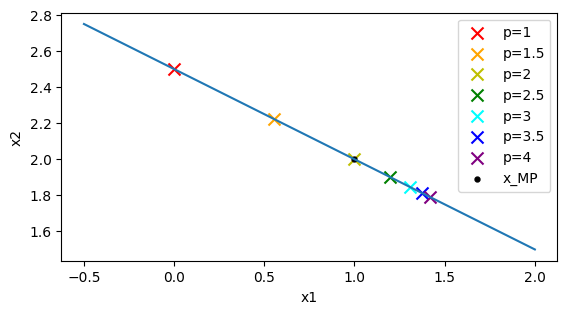

The blue line represents the constraint equation. The meanings of the crosses are as the legend.

#### d.)

Moore-Penrose generalised inverse corresponds `p = 2`. As shown in the plot above, the dot represents $x_{\text{MP}}$ is at the same location as `p = 2`.

When `p = 2`, we can rewrite the problem as:
$$
\text{minimize}\ \ \ \Phi=x^Tx, \ \ \ \ \text{subject to} \ \ \ \ Ax=b \\
\text{where} \ \ A = (1 \ \ 2), \ b=5
$$
, which is equivalent to the problem:
$$
\text{minimize}\ \ \ \Phi=x^Tx -  \lambda^T(Ax-b) \\
\text{where} \ \ A = (1 \ \ 2), \ b=5
$$
We can solve it:
$$
\left\{
\begin{aligned}
\frac{d\Phi}{dx} = 0 \\ 
\frac{d\Phi}{d\lambda} = 0
\end{aligned}
\right.\\
\left\{
\begin{aligned}
& 2x - A^T\lambda = 0 \\ 
& Ax - b = 0
\end{aligned}
\right.\\
\left\{
\begin{aligned}
& \lambda = 2(AA^T)^{-1}b \\ 
& x = A^T(AA^T)^{-1}b = x_{\text{MP}}
\end{aligned}
\right.
$$
and $ A^T(AA^T)^{-1}$ is the $A^{\dagger}$.

<div style="page-break-after:always"></div>

### 2. Singular Value Decomposition

#### a.)

I use `numpy.linspace` to create the spatial grid.

```python
def spatial_grid(n):
    return np.linspace(-1., 1., num=n)
```

#### b.)

I create a function to calculate the value of Gaussian function in a numpy vector.

```python
def gaussian_func(x, n, mu=0., sig=0.2):
    delta_n = 2. / (n - 1)
    return delta_n / np.sqrt(2 * np.pi) / sig * np.exp(-(x - mu) * (x - mu) / (2. * sig * sig))
```

#### c.)

I create a function to generate a convolution matrix.

```python
def convolution_matrix(n, mu=0., sig=0.2):
    x = np.array([spatial_grid(n)])
    x2d = np.tile(x, (n, 1)).T - x
    return gaussian_func(x2d, n, mu, sig)
```

Just follow the definition of $A_{i,j}$.

#### d.)

The plot of the matrix $A$ when $n=100$ is as below.

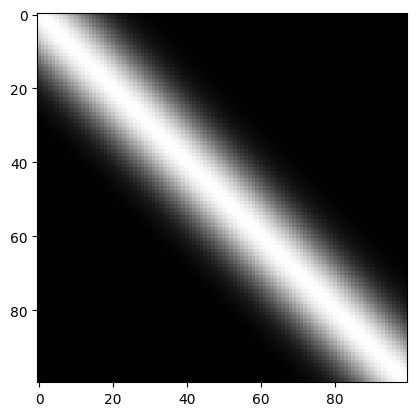

#### e.)

I use `numpy.linalg.svd` to compute $\text{SVD}$.

```python
def svd(A):
    u, s, vt = np.linalg.svd(A, full_matrices=True)
    return u, s, vt
```

I use two methods to verify $A=UWV^T$ and the results are in the comments.

```python
u, s, vt = svd(A)
print(((u * s) @ vt - A < 1e-12).all()) # True
print(np.linalg.norm((u * s) @ vt - A)) # 3.865089147759237e-15
```

#### f.)

I create a function to calculate the pseudoinverse.

```python
def pseudoinverse(A):
    u, s, vt = svd(A)
    W = np.diag(s)
    Wi = np.linalg.pinv(W)
    assert (Wi @ W - np.identity(W.shape[0]) < 1e-12).all()
    assert (W @ Wi - np.identity(W.shape[0]) < 1e-12).all()
    return vt.T @ Wi @ u.T
```

I use `numpy.linalg.pinv` to get the $W^\dagger$, and the assertation is used to check $WW^{\dagger} = W^{\dagger}W = Idn$.

For $n=10$, I write some code to calculate the $\text{SVD}$ and verified the generated pseudoinverse. The results are in the comments.

```python
n = 10
A = convolution_matrix(n)
Ai_np = np.linalg.pinv(A)
Ai = pseudoinverse(A)
print(np.linalg.norm(Ai - Ai_np)) # 3.5827277168872394e-15
print((Ai @ A - np.identity(A.shape[0]) < 1e-12).all()) # True
print((A @ Ai - np.identity(A.shape[0]) < 1e-12).all()) # True
```

The pseudoinverse is very similar to the true inverse.

#### g.)

For $n=20$, the code and results are as below.

```python
n = 20
A = convolution_matrix(n)
Ai_np = np.linalg.pinv(A)
Ai = pseudoinverse(A)
print(np.linalg.norm(Ai - Ai_np)) # 3.651758567089755e-10
print((Ai @ A - np.identity(A.shape[0]) < 1e-10).all()) # True
print((A @ Ai - np.identity(A.shape[0]) < 1e-10).all()) # True
```

Although the pseudoinverse is effective, the accuracy is not as good as the case of $n=10$.

For $n=100$, the code and results are as below.

```python
n = 100
A = convolution_matrix(n)
Ai_np = np.linalg.pinv(A)
Ai = pseudoinverse(A)
print(np.linalg.norm(Ai - Ai_np)) # 0.04085877562246467
print((Ai @ A - np.identity(A.shape[0]) < 1).all()) # True
print((A @ Ai - np.identity(A.shape[0]) < 1).all()) # True
```

The effect of pseudoinverse is not so close as the true inverse.

|               The first 9 columns of $V$                |                The last 9 columns of $V$                |
| :-----------------------------------------------------: | :-----------------------------------------------------: |
| 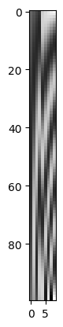 | 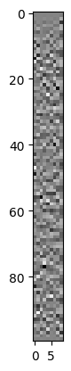 |

The first 9 columns is more meaningful than the last 9 columns. The coresponding singular values of last 9 columns is probably very small. From the plot of singular values below we can know it is true.

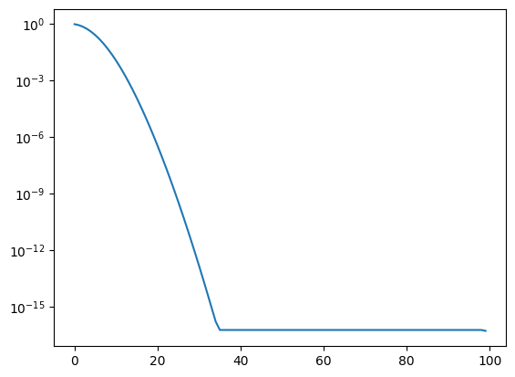

<div style="page-break-after:always"></div>

### 3. Convolutions and Fourier transform 

#### a.)

The function calculating $f(x)$ is as below.

```python
def X(x, a, b):
    xc = x.copy()
    idx = (a<x)&(x<=b)
    xc[idx] = 1
    xc[~idx] = 0
    return xc

def f(x):
    return X(x, -0.95, -0.6) + 0.2 * X(x, -0.6, -0.2) - 0.5 * X(x, -0.2, 0.2) + 0.7 * X(x, 0.4, 0.6) - 0.7 * X(x, 0.6, 1)
```

The plot is as below:

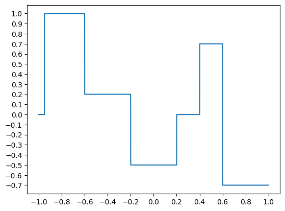

#### b.)

The plots of singular values:

| $\sigma$ |                 Plots of Singular Values                 |
| :------: | :------------------------------------------------------: |
|  $0.05$  | 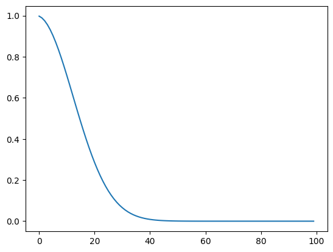  |
|  $0.1$   | 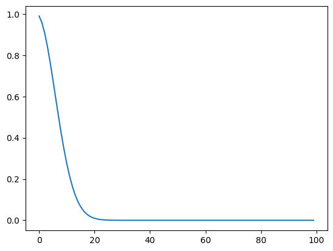  |
|  $0.2$   | 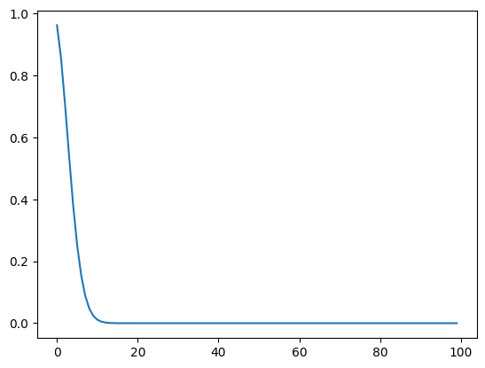 |

#### c.)

I flipped the original image of singular values horizontally and stitched it together with the original image to create a new image. The shapes look like Gaussian functions. The variances can be calculated by the largest singular values, which are the centre values of the Gaussian functions.

| $\sigma$ |            Expanded Plots of Singular Values             |  Variance  |
| :------: | :------------------------------------------------------: | :--------: |
|  $0.05$  | 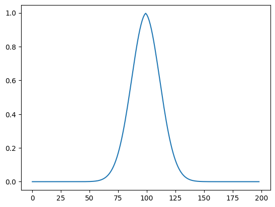 | $0.400082$ |
|  $0.1$   | 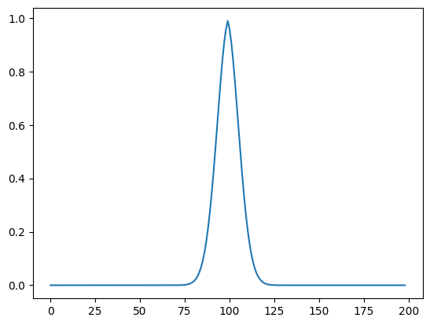 | $0.403275$ |
|  $0.2$   | 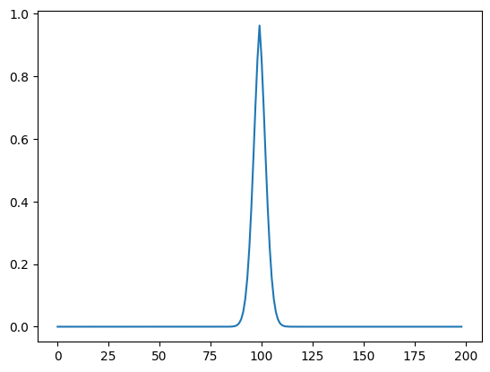 | $0.414747$ |

#### d.)

When calculating the convolution of $f$ and $A$, we should make the height and width of $A$ the same as the number of sampled points from $f$. The code example of $\sigma=0.05$ is as below.

```python
n = 10000
x = np.linspace(-1., 1., num=n)
fx = f(x)
A005 = convolution_matrix(n, 0, 0.05)
by = A005 @ fx
plt.plot(x, by)
plt.show()
```

The results are as below.

| $\sigma$ |                       convoluted                        | $\sigma$ |                       convoluted                        |
| :------: | :-----------------------------------------------------: | :------: | :-----------------------------------------------------: |
|   $/$    | 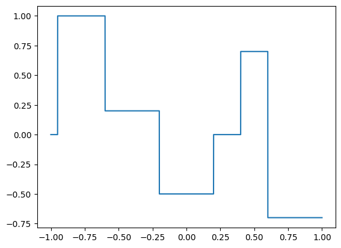 |  $0.1$   | 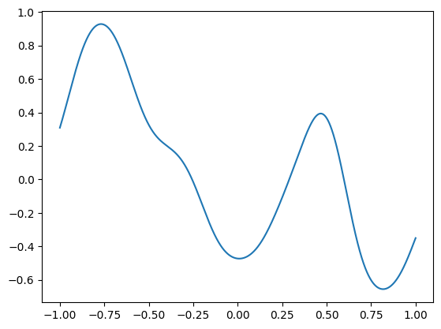 |
|  $0.05$  | 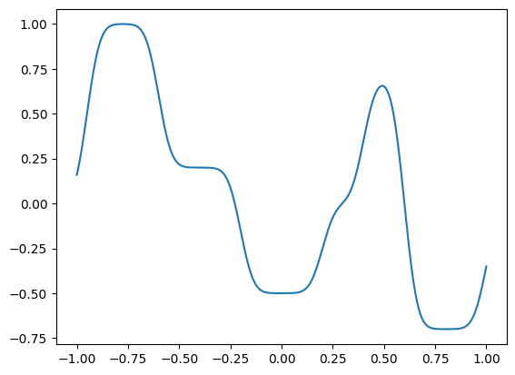 |  $0.2$   | 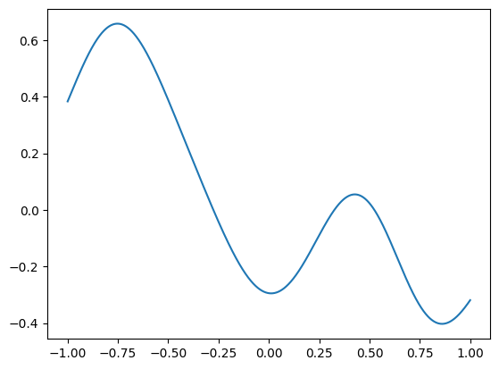 |

#### e.)

Actually, the matrix $A$ is a Toeplitz matrix. The vector multiplication of the Toeplitz matrix can be accelerated by $\text{FFT}$. The Toeplitz matrix is characterised by the fact that all elements on the same diagonal are equal. Therefore, we can use the first row and the first column to represent the whole matrix, which can be written as a vector (assume it is $z$). Then we pad the data from $f$ with $0$ to align with the vector $z$ to perform $\text{FFT}$ convolution. The code example of $\sigma=0.05$ is as below.

```python
def conv1D(m, filter):
    m_feq = np.fft.fft(m)
    filter_feq = np.fft.fft(filter, m.shape[0])
    return np.fft.ifft(m_feq * filter_feq).real

n = 10000
x = np.linspace(-1., 1., num=n)
fx = f(x)
A005 = convolution_matrix(n, 0, 0.05)
z = np.hstack((A005[:, 0], np.zeros((1,)), A005[0, ::-1][:-1]))
by = conv1D(np.hstack((fx, np.zeros((n,)))), z)[:n]
plt.plot(x, by)
plt.show()
```

The results are the same as the normal matrix multiplication.

#### f.)

The matrix A, which is a Toeplitz matrix, is extremely regular and periodic, so we can use this property to accelerate the generation of the matrix A. The library function `scipy.linalg.toeplitz`  can help us to do so. The code example of $\sigma=0.05$ is as below.

```python
def convolution_matrix_toeplitz(n, mu=0., sig=0.2):
    x = spatial_grid(n)
    xc = x - x[0]
    xr = -xc.copy()
    return toeplitz(gaussian_func(xc, n, mu, sig), gaussian_func(xr, n, mu, sig))
```

The effect is the same as the formal version, but it is faster. We can see the effect in the following case: using the new function to generate $A$ makes it more than $8$ times faster ($4.2\text{s}$ to $0.5\text{s}$).

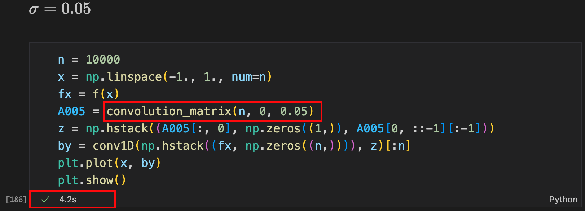

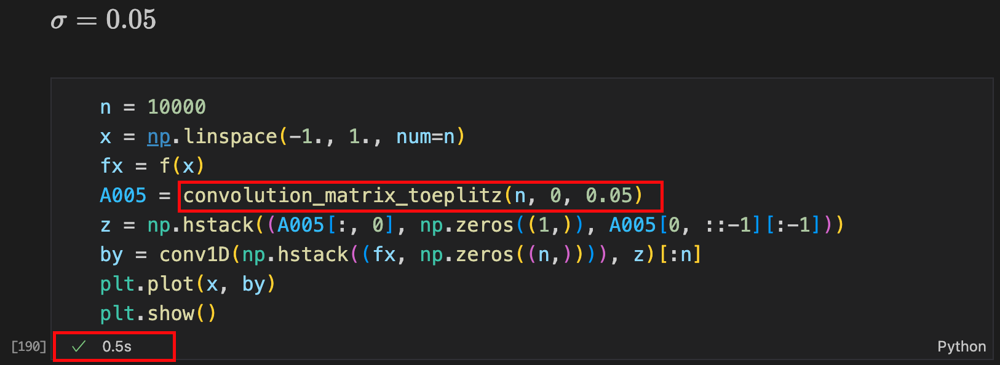