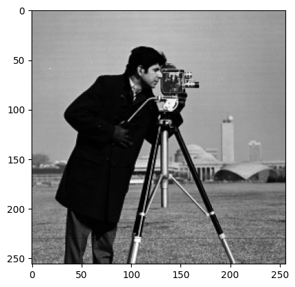
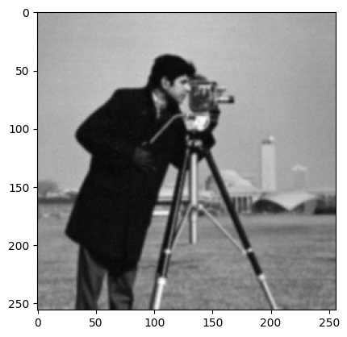
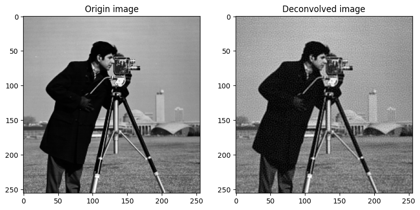
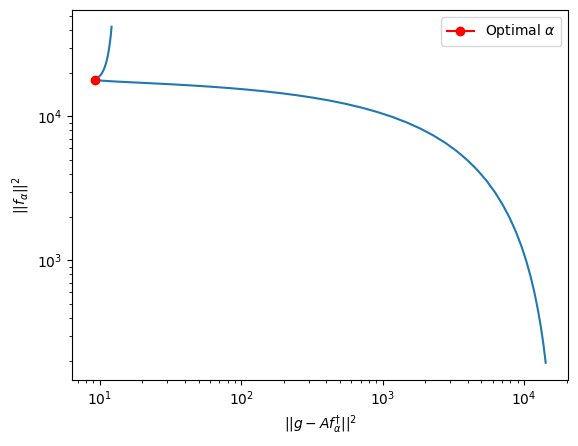
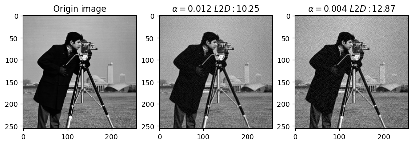
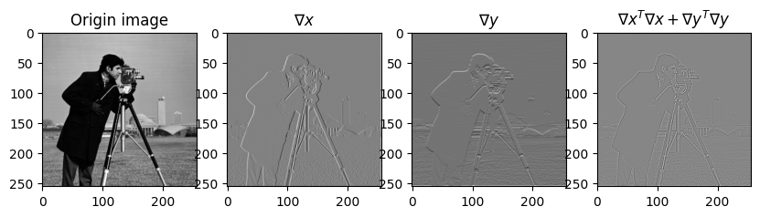
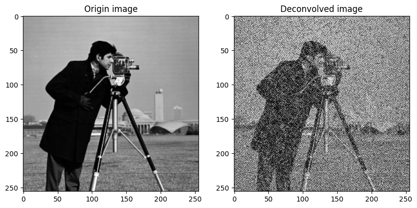
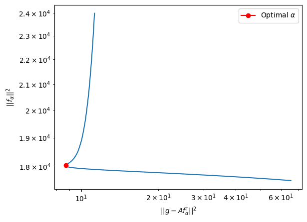
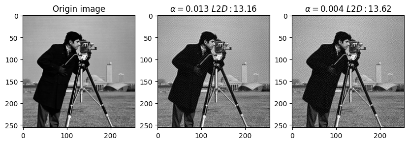
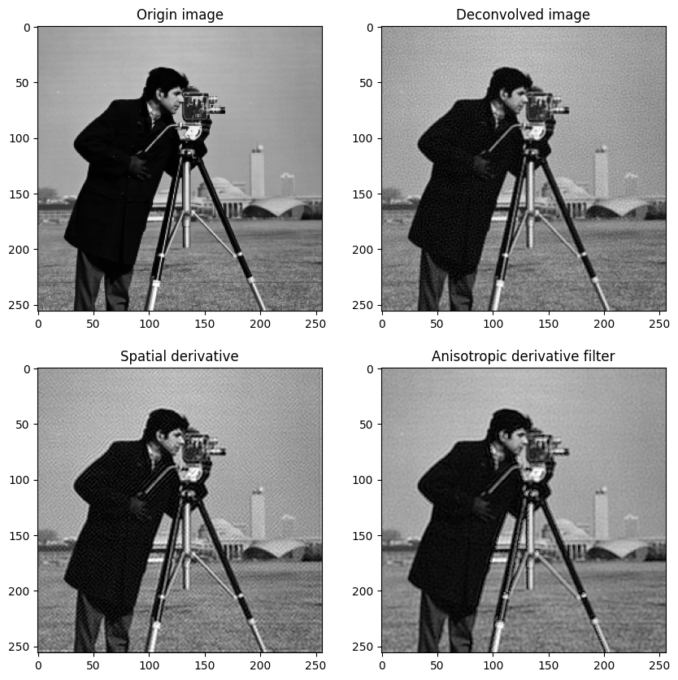

## COMP0114 Inverse Problems in Imaging. Coursework 2

### 1. Convolution and deconvolution

#### a.)

The image I use in the whole course work2 is as below, the intensities in this image are already in $[0, 1]$.



#### b.)

I use `scipy.ndimage.gaussian_filter` to blur images.

```python
from scipy.ndimage import gaussian_filter
def blur(image, sigma=1, theta=0.01):
    g = gaussian_filter(image, sigma)
    w, h = g.shape
    g = g + theta * np.random.randn(w, h)

    return g

plt.imshow(blur(gray_image), cmap='gray')
```

Below is the blurred image. 




#### c.)

The function computes $(A^\text{T}A+\alpha I)f$  is as below.

```python
def ATA(v):
    image = v.reshape((height, width))
    y = gaussian_filter(image, sigma)
    z = gaussian_filter(y, sigma) + alpha * image

    return z.reshape(v.shape)
```

Since the default kernel of `scipy.ndimage.gaussian_filter` has an odd kernel size, the transposed operator of $Af$ is the same as the original operator.

I use $\text{GMRES}$ to solve $f_{\alpha}$, and `alpha`, `sigma`, `theta` are global variables:

```python
sigma = 1
theta = 0.01
alpha = 0.01
```

The procedure of solving $f_{\alpha}$ is as below.

```python
A = scipy.sparse.linalg.LinearOperator((height * width, height * width), ATA)
ATg = gaussian_filter(blur(gray_image, sigma, theta), sigma).reshape((height * width,))
counter = gmres_counter(disp=False)
x, info = scipy.sparse.linalg.gmres(A, ATg, callback=counter)
```

The result is shown below. It takes $32$ iterations to converge.



#### d.) 

Like part **c.)**, we should write a function to calculate $\begin{pmatrix}
A\\
\sqrt{\alpha}I\\
\end{pmatrix}f$ at first.

```python
def M_f(v):
    image = v.reshape((height, width))
    y = gaussian_filter(image, sigma).reshape(v.shape)
    z = np.hstack((y, np.sqrt(alpha) * v))

    return z

def MT_b(v):
    length = height * width
    image = v[: length].reshape((height, width))
    y = gaussian_filter(image, sigma).reshape(length)
    z = y + np.sqrt(alpha) * v[length:]

    return z
```

The function `M_f` calculates  $\begin{pmatrix}
A\\
\sqrt{\alpha}I\\
\end{pmatrix}f$ , and `MT_b` is the transpose operator of `M_f`.

The procedure of solving the augmented equations is as below.

```python
M = scipy.sparse.linalg.LinearOperator((2 * height * width, height * width), matvec=M_f, rmatvec=MT_b)
g = blur(gray_image, sigma, theta).reshape((height * width,))
b = np.hstack((g, np.zeros(g.shape)))
x = scipy.sparse.linalg.lsqr(M, b)
```

The result is shown below. It takes $43$ iterations to converge, which is a little bit longer than solving normal equations in this case.


### 2. Choose a regularisation parameter α

#### i.) Discrepency Principle

Calculating $\text{DP}(\alpha)$ by $\text{SVD}$ cost too much time, so I calculate $\text{DP}(\alpha)$ by original definition:
$$
\text{DP}(\alpha):=\frac{1}{n}||\mathbf{r}_{\alpha}||^2-\sigma ^2 \\
\text{where} \space \mathbf{r}_{\alpha}:=g-Af_{\alpha}^{\dagger}
$$
.

Here, $g$ represents the blurred image, and $f_{\alpha}^{\dagger}$ is the solved $f_{\alpha}$. Below is the code solving $\text{DP}(\alpha)=0$.

```python
A = scipy.sparse.linalg.LinearOperator((height * width, height * width), ATA)
g = blur(gray_image, sigma, theta)
ATg = gaussian_filter(g, sigma).reshape((height * width,))

def dp_alpha(a):
    # calculate DP(alpha)
    global alpha
    alpha = a
    f, _ = scipy.sparse.linalg.gmres(A, ATg) # solve f_alpha
    Af = gaussian_filter(f.reshape((height, width)), sigma)
    r_alpha = g - Af.reshape(g.shape)
    nr = np.linalg.norm(r_alpha)
    
    # use theta not sigma, theta controls the noise level
    return np.abs(nr * nr / (height * width) - theta * theta) 

sol = scipy.optimize.minimize_scalar(dp_alpha, bounds=(1e-6, 1), method='bounded')
alpha = sol.x
```

The optimal $\alpha$ in this case is $0.011951$, the remaining value of $\text{DP}(\alpha)$ is $8.06e-09$.

#### ii.) L-Curve

I uniformly sample $100$ points in $[10^{-6}, 1]$ in the log space, and use them as $\alpha$s to calculate the $\text{L-Curve}$.

The generated $\text{L-Curve}$ is as below.



Then I find the point which has the largest curvature, use the corresponding $\alpha$ as the optimal $\alpha$. In this case, the optimal $\alpha$ is $0.00437$.

#### Compare two optimal $\alpha$s

Below is the plot containing results of deconvolving with two optimal $\alpha$s.



Although there is almost no difference to the naked eye, there is a slight difference in the $\text{L}2$ Distance between the two images and the original one. But it doesn't make much of a difference, and both alpha's are pretty good choices.

### 3. Using a regularisation term based on the spatial derivative

#### a.)

I use explicit sparse matrix to construct the gradient operator $D=\begin{pmatrix}
\nabla x\\
\nabla y\\
\end{pmatrix}$.

In actual calculation, the image matrix will be vectorized into a vector $f$, and the gradient operator will apply directly to $f$. The gradient operator actually subtracts adjacent elements from the image. Therefore, if we want to know the gradient of a pixel point in the image, we just need to know the indices of two elements needed to calculated the gradient in $f$. Then construct a vector $d$, making the element not at the index positions $0$, and element at the index positions $1$ (or $-1$). At last, $d^\text{T}f$ is the gradient value. For example, if we have image $Im=\begin{bmatrix}
1&2&3 \\
4&5&6 \\
7&8&9 \\
\end{bmatrix}$, then vertorize it to $f=\begin{pmatrix}
1&2&3&4&5&6&7&8&9
\end{pmatrix}^\text{T}$. If we want to know the gradient of element $5$ along x-axis, we can construct vector $d=\begin{pmatrix}
0&0&0&-1&1&0&0&0&0
\end{pmatrix}^\text{T}$, then $d^\text{T}f=1$ is the grandient we want to know. This method can be applied to all the elements in the image, so that we can construct the matrix $D$. The code I use to construct the matrix $D$ is as below:

```python
N = height
data = np.array([np.ones((N,)), -np.ones((N,))])
diags = np.array([0, 1])
a = scipy.sparse.spdiags(data, diags, N, N)
# gxm.shape == (N * N, N * N)
gxm = scipy.sparse.kron(scipy.sparse.identity(N), a)
gym = scipy.sparse.kron(a, scipy.sparse.identity(N))
```

, where `gxm` is $\nabla x$ and `gym` is $\nabla y$.



#### b.) 

##### Deconvolve using normal equations

Now we should find $f_{\alpha}$ as the solution to $(A^\text{T}A+\alpha D^{\text{T}}D)f_{\alpha}=A^\text{T}g$.

We have $D=\begin{pmatrix}
\nabla x\\
\nabla y\\
\end{pmatrix}$, so $D^{\text{T}}D=\begin{pmatrix}
\nabla x^\text{T} & \nabla y^\text{T}\\
\end{pmatrix} \begin{pmatrix}
\nabla x\\
\nabla y\\
\end{pmatrix}=\nabla x^\text{T}\nabla x+\nabla y^\text{T}\nabla y$.

Therefore, we can change function `ATA` as below to calculate $(A^\text{T}A+\alpha D^{\text{T}}D)f$ :

```python
def ATA_G(v):
    image = v.reshape((height, width))
    ATAf = gaussian_filter(gaussian_filter(image, sigma), sigma)
    DTDf = (gxm.T @ gxm + gym.T @ gym) @ v
    z = ATAf 
    
    return z.reshape(v.shape) + alpha * DTDf
```

Other procedure is same as **1.c**. However, this method converges very slow in this case. I set $\alpha=10^{-7}$ and it takes $1471$ iterations to converge. The result image is as below.



We can see the result is quiet noisy due to the small $\alpha$ value. 

#####Deconvolve using augmented equations

As **Deconvolve using normal equations**, we need to change `M_f` and `MT_b` to add in the gradient operator:

```python
def M_fG(v):
    image = v.reshape((height, width))
    y = gaussian_filter(image, sigma).reshape(v.shape)
    dfx = np.sqrt(alpha) * gxm @ v
    dfy = np.sqrt(alpha) * gym @ v
    z = np.hstack((y, dfx, dfy))

    return z

def MT_bG(v):
    length = height * width
    image = v[: length].reshape((height, width))
    y = gaussian_filter(image, sigma).reshape(length)
    dfxt = np.sqrt(alpha) * v[length: 2 * length] @ gxm.T
    dfyt = np.sqrt(alpha) * v[2 * length:] @ gym.T
    z = y + dfxt + dfyt

    return z
```

Other procedure is similar as **1.d**. This time this method converges faster. I set $\alpha=10^{-2}$ and it the result image is as below.


The result is better than the normal equations ones.

#### c.)

This time I use solving augmented equations instead of solving normal equations when calculating $\alpha$.

The code is similar so I show the result directly.

Below is the $\text{L-Curve}$ :



Below is the optimal $\alpha$s and corresponding deconvolved images:



Still,  there are almost no difference. But $\alpha=0.013$ is better because its convegence speed is actully faster in this case.

### 4. Construct an anisotropic derivative filter

According to the Perona-Malik function
$$
\gamma(f)=\exp(-\sqrt{(\nabla_xf)^2+(\nabla_yf)^2}/T)
$$
, $\gamma(f)$ have the same size as the image.

Since each line of  the $\nabla_x$ $(\nabla_y)$ can compute the gradient of one pixel, we can "flat" $\gamma(f)$ to a diagonal matrix, which can apply $\gamma$ to each line of $\nabla_x$ $(\nabla_y)$ by matrix multiply. For example, if  $\gamma(f)=\begin{bmatrix}
1&2\\
3&4\\
\end{bmatrix}$, then we can  "flat" it to $\begin{bmatrix}
1&0&0&0\\
0&2&0&0\\0&0&3&0\\0&0&0&4\\
\end{bmatrix}$.

In the actual implementation, I do not use the Perona-Malik function, instead I use:
$$
\sqrt{\gamma}D:=\begin{pmatrix}
\sqrt{\gamma_x}\nabla x\\
\sqrt{\gamma_y}\nabla y\\
\end{pmatrix}\\
\text{where} \ \gamma_x=\exp(-\nabla_xf/T),\gamma_y=\exp(-\nabla_yf/T)
$$
. The code is as below:

```python
blurred = blur(gray_image, sigma, theta)
gx, gy = fgx(blurred), fgy(blurred)
scalar = 1
T = scalar * np.linalg.norm(np.sqrt(gx * gx + gy * gy))

gamma_x = np.exp(-gx / T).reshape((height * width,))
data = np.array([gamma_x])
diags = np.array([0])
gamma_x_sp = scipy.sparse.spdiags(data, diags, height * width, height * width)

gamma_y = np.exp(-gy / T).reshape((height * width,))
data = np.array([gamma_y])
diags = np.array([0])
gamma_y_sp = scipy.sparse.spdiags(data, diags, height * width, height * width)

gxm_gamma = np.sqrt(gamma_x_sp) @ gxm
gym_gamma = np.sqrt(gamma_y_sp) @ gym
```

### 5. Iterative deblurring

Please refer to my code to see the whole iterative process.

For the number of iterations, it can be iterated a fixed number of times, enough to wait for a better result to appear. Alternatively, the iteration may be stopped if the resultant image does not appear to change significantly after several iterations. In this case we can specify a threshold to determine what is an insignificant change, as well as specifying how many times the iterations can be stopped after no significant change has occurred.

In my experiment, after 30 iterations, we can get the result shown at the bottom right corner in the plot below. Compare to the deconvolved image using other methods, this method produces a smoother result.


